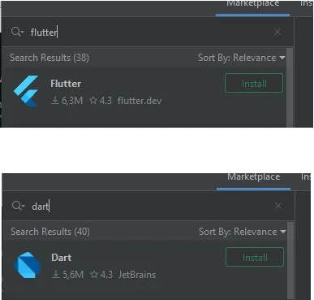
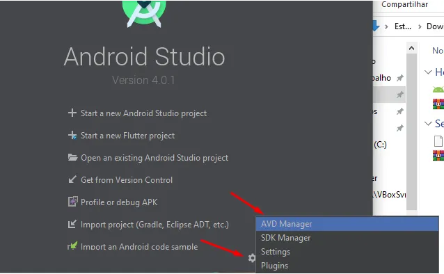
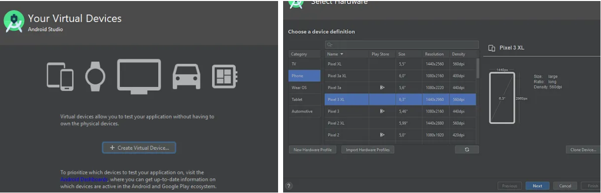
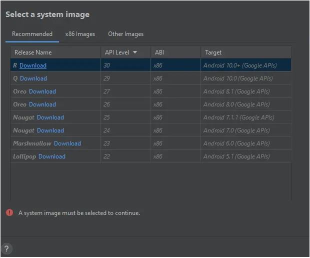

Após o Tutorialpt3, prossiga da seguinte maneira.

Basta ir na opção de plugins e procurar por Dart e Flutter

Agora vamos configurar as Android Virtual Devices(AVD) que são os emuladores androides.

Iremos escolher um modelo já pré configurado de um dispositivo real

Nesta parte é mais demorado, teremos que fazer o download da versão do Android SDK, podemos escolher a ultima versão.

Feito isso nosso flutter doctor do ficara com a pendencia do Visual Studio CODE, teremos que instala-lo
