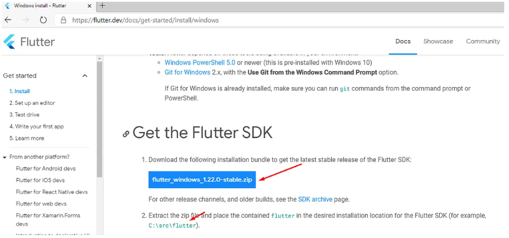
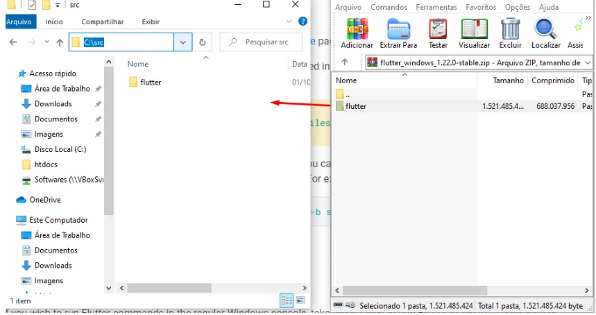
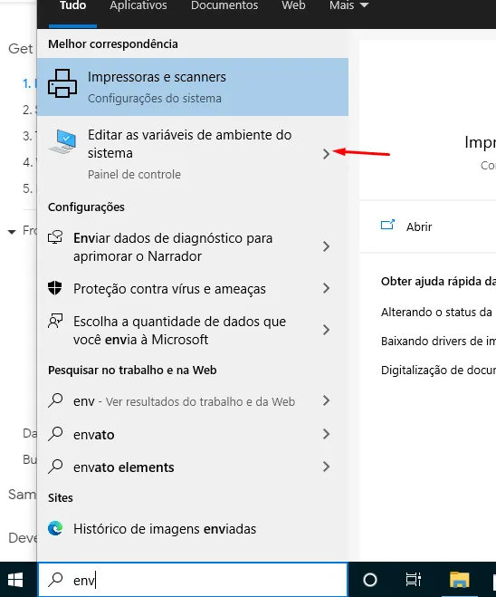
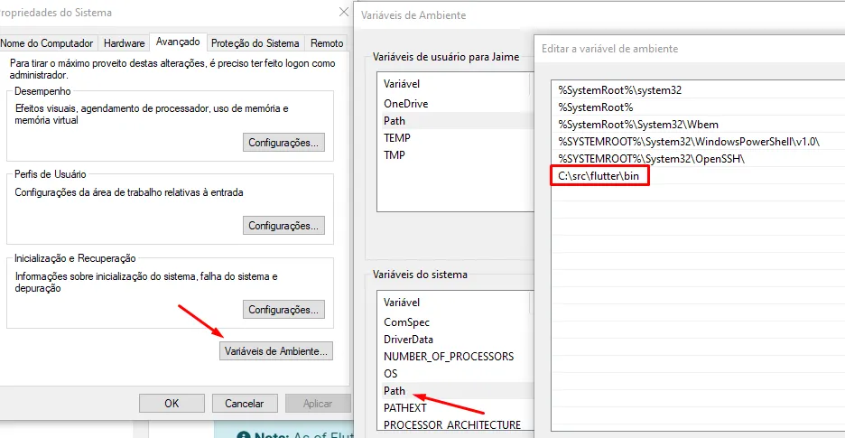

Passo 1: Fazer download do Flutter

Acesse o site oficial do Flutter:
🔗 https://flutter.dev/docs/get-started/install/windows

Baixe o arquivo .zip da versão estável do Flutter:
Exemplo: `flutter_windows_1.22.0-stable.zip`

Atenção:
Não instale o Flutter em C:\Program Files\, pois essa pasta requer permissões de administrador.

Passo 2: Extrair o Flutter

Após o download, extraia o arquivo .zip em uma pasta de sua preferência.
Recomenda-se criar a pasta:

C:\src

O resultado será algo como:

C:\src\flutter

Agora seguindo os passos da documentação precisamos configurar a variavel de ambiente PATH

Para isso vá a barra de pesquisa do windows e digite “env” e selecione a opção Editar as variáveis de ambiente do sistema

Conforme a imagem a seguir.

Edite a variável Path adicionando o diretório bin do flutter , se colocou em C:\src vai ficar C:\src\flutter\bin

Conforme a imagem a seguir.

