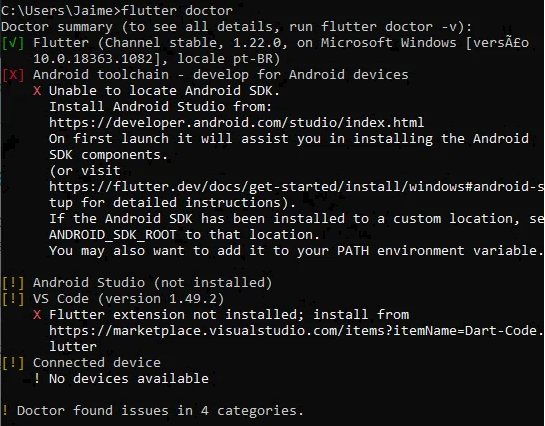

Após configurar o PATH já é possível executar o comando flutter no prompt de comando,
abra seu terminal e digite flutter doctor,terá o seguinte resultado.

O comando flutter doctor nos auxiliara na instalação do flutter, 
podemos notar que há varias pendencias, precisamos resolver uma por uma.

A primeira coisa que faremos é instalar o android studio disponível em:
https://developer.android.com/studio?hl=pt-br
