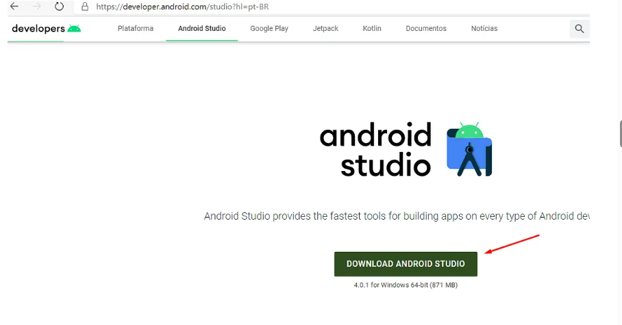
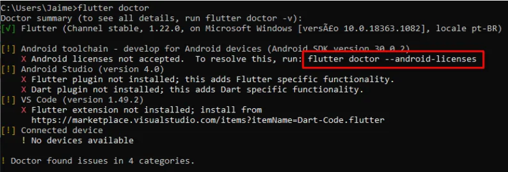
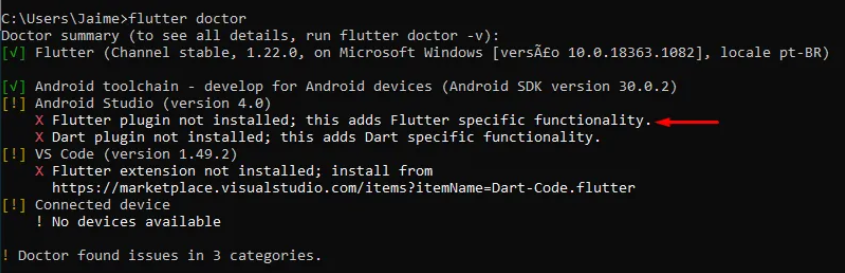

Guia de Configuração Inicial do Flutter e Android Studio
Este guia irá orientá-lo na instalação do Android Studio e na resolução das pendências iniciais de configuração do Flutter.

1. Instalação do Android Studio
O primeiro passo é instalar o Android Studio, que é essencial para o desenvolvimento de aplicativos Android e para fornecer o SDK (Kit de Desenvolvimento de Software) necessário ao Flutter.

Baixe o Android Studio diretamente no site oficial:

Link: https://developer.android.com/studio?hl=pt-br

A instalação é padrão: siga as instruções do instalador clicando em Next > Next > Finish.

2. Verificação Inicial com flutter doctor
Após instalar o Android Studio, você pode verificar o status da sua instalação do Flutter no terminal ou Prompt de Comando.

Execute o seguinte comando:

Bash

flutter doctor

Neste ponto, você notará que algumas pendências iniciais foram resolvidas (como a ferramenta Android SDK), mas outras ainda permanecem.

3. Aceitação das Licenças Android
Um dos problemas mais comuns após a instalação do Android Studio é a não aceitação das licenças do Android SDK.

Para resolver isso, copie e execute o comando sugerido pelo próprio flutter doctor (realce em vermelho na imagem):

Bash

flutter doctor --android-licenses
Siga as instruções na tela, digitando y (sim) e pressionando Enter para aceitar todas as licenças que aparecerem.

