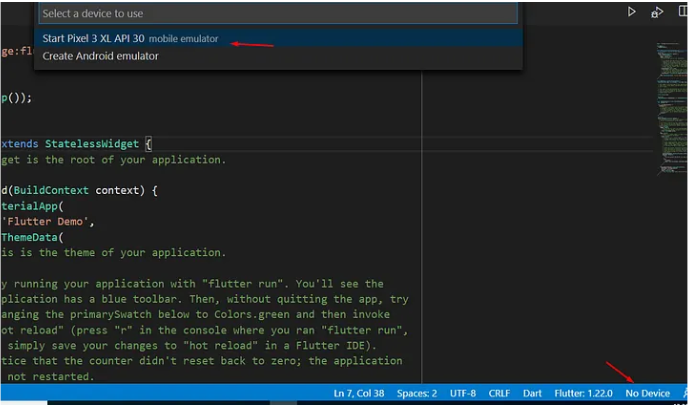

Para iniciar o emulador, no canto inferior direito terá uma opção “No Devices” basta clicar lá e a lista de emuladores disponíveis irá aparece,
se você estiver com seu smartphone Android conectado e com as opções de desenvolvedor ativado ele também será listado.

E finalmente a estrutura básica do seu projeto será criado.
